# paliativeKSP - Complete System Architecture

เอกสารนี้ออกแบบสถาปัตยกรรมทั้งระบบสำหรับ `paliativeKSP` ในรูปแบบที่นำไปใช้ต่อได้จริงกับระบบดูแลผู้ป่วย Palliative Care ระดับโรงพยาบาล/รพ.สต./ทีมเยี่ยมบ้าน

> อ้างอิงต่อยอดจาก `docs/flowchart.md` ซึ่งมี flow หลักของระบบ, patient workflow, DFD, ERD และ API sequence ไว้แล้ว

---

## 1. Architecture Goals

ระบบ `paliativeKSP` ควรถูกออกแบบเพื่อรองรับเป้าหมายหลักดังนี้

1. ลงทะเบียนและติดตามผู้ป่วย Palliative Care
2. บันทึกการประเมิน PPS, ESAS, Pain Score และข้อมูลเยี่ยมบ้าน
3. สนับสนุนการทำงานของทีมสหวิชาชีพ เช่น แพทย์ พยาบาล เจ้าหน้าที่ และผู้ดูแลระบบ
4. เชื่อมโยงข้อมูลจากระบบโรงพยาบาล เช่น HOSxP/HIS ในอนาคต
5. สร้างรายงานสำหรับบริหารจัดการและส่งออก PDF/Excel
6. มีความปลอดภัยด้านข้อมูลสุขภาพและสิทธิ์การเข้าถึง
7. รองรับการพัฒนาเป็น Web App, Mobile App และ API กลาง

---

## 2. High-Level System Architecture

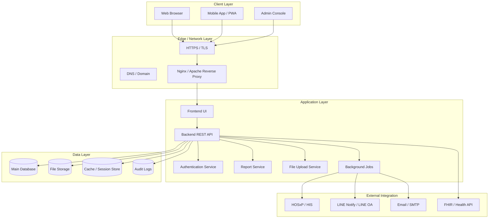

---

## 3. Recommended Technology Stack

### Option A: PHP / Laravel Stack

เหมาะกับระบบราชการ/โรงพยาบาลที่ต้อง deploy ง่ายบน Linux + Apache/Nginx

```text
Frontend     : Blade / Vue / React
Backend      : Laravel
Database     : MySQL / MariaDB
Auth         : Laravel Sanctum / Session
Queue        : Laravel Queue + Cron
Report       : DomPDF / PhpSpreadsheet
Web Server   : Nginx or Apache
Deployment   : Docker Compose or bare metal Linux
```

### Option B: Node.js / Express / React Stack

เหมาะกับระบบ API-first และต่อ Mobile ได้ง่าย

```text
Frontend     : React / Next.js
Backend      : Node.js + Express / NestJS
Database     : PostgreSQL / MySQL
Auth         : JWT + Refresh Token
Queue        : BullMQ / Redis
Report       : PDFKit / ExcelJS
Web Server   : Nginx Reverse Proxy
Deployment   : Docker Compose / VPS
```

### Option C: Python / FastAPI Stack

เหมาะกับการต่อยอด AI/Analytics/Prediction ในอนาคต

```text
Frontend     : React / Vue
Backend      : FastAPI
Database     : PostgreSQL
Auth         : JWT / OAuth2
Queue        : Celery / Redis
Report       : WeasyPrint / OpenPyXL
Deployment   : Docker Compose / Kubernetes
```

---

## 4. Layered Architecture

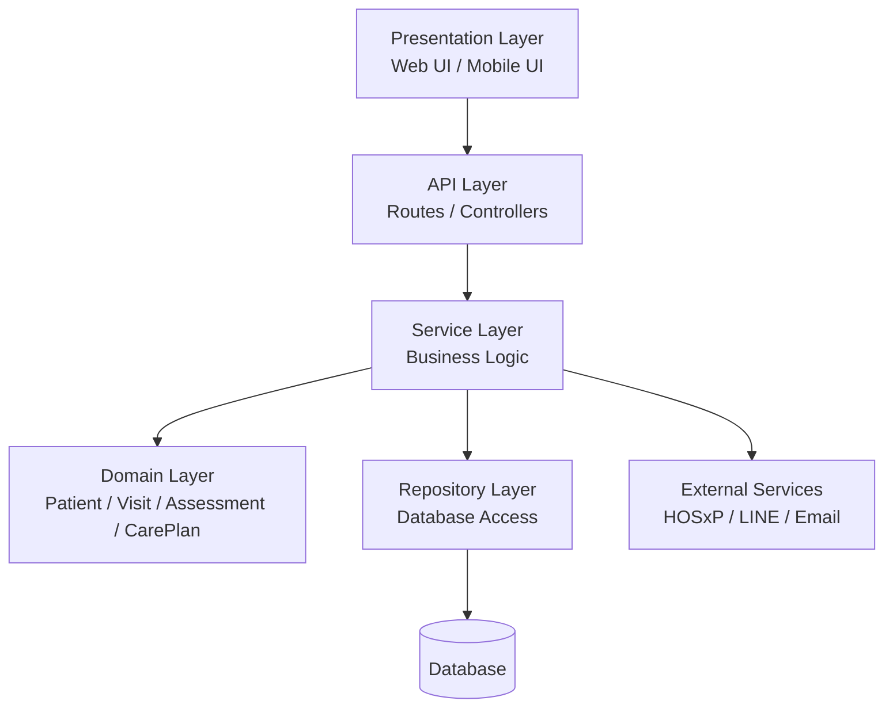

### Responsibility

| Layer | หน้าที่ |
|---|---|
| Presentation | แสดงผล Dashboard, Forms, Patient Profile |
| API | รับ Request, Validate Input, ส่ง Response |
| Service | จัดการ Logic เช่น คำนวณสถานะ, สร้าง Care Plan |
| Domain | โครงสร้างข้อมูลหลัก เช่น Patient, Visit, Assessment |
| Repository | Query/Insert/Update/Delete Database |
| External | เชื่อมระบบภายนอก เช่น HOSxP, LINE, SMTP |

---

## 5. Main Modules

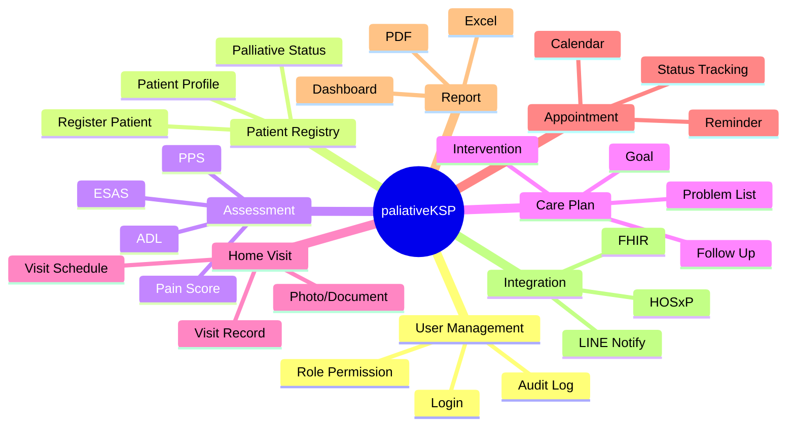

---

## 6. User Roles and Permission Model

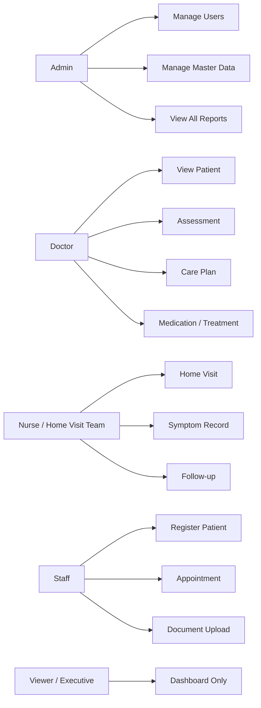

### Permission Matrix

| Feature | Admin | Doctor | Nurse | Staff | Viewer |
|---|---:|---:|---:|---:|---:|
| Manage Users | ✅ | ❌ | ❌ | ❌ | ❌ |
| Register Patient | ✅ | ✅ | ✅ | ✅ | ❌ |
| View Patient | ✅ | ✅ | ✅ | ✅ | ✅ |
| Assessment | ✅ | ✅ | ✅ | ❌ | ❌ |
| Care Plan | ✅ | ✅ | ✅ | ❌ | ❌ |
| Home Visit | ✅ | ✅ | ✅ | ❌ | ❌ |
| Reports | ✅ | ✅ | ✅ | ✅ | ✅ |
| Export Data | ✅ | ✅ | ✅ | ✅ | ❌ |
| Delete Data | ✅ | ❌ | ❌ | ❌ | ❌ |

---

## 7. Core Database Architecture

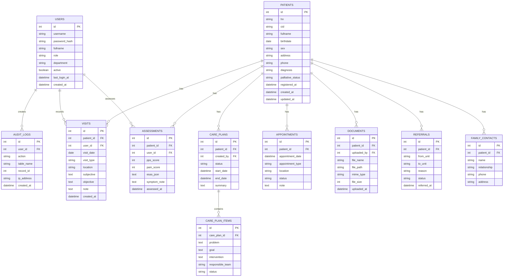

---

## 8. API Architecture

### API Grouping

```text
/api/auth
/api/users
/api/patients
/api/assessments
/api/care-plans
/api/visits
/api/appointments
/api/documents
/api/reports
/api/integrations
/api/settings
```

### Example REST Endpoints

| Method | Endpoint | Description |
|---|---|---|
| POST | `/api/auth/login` | เข้าสู่ระบบ |
| POST | `/api/auth/logout` | ออกจากระบบ |
| GET | `/api/patients` | รายชื่อผู้ป่วย |
| POST | `/api/patients` | เพิ่มผู้ป่วย |
| GET | `/api/patients/{id}` | รายละเอียดผู้ป่วย |
| PUT | `/api/patients/{id}` | แก้ไขข้อมูลผู้ป่วย |
| POST | `/api/patients/{id}/assessments` | บันทึก PPS/ESAS/Pain Score |
| POST | `/api/patients/{id}/visits` | บันทึกการเยี่ยมบ้าน |
| POST | `/api/patients/{id}/care-plans` | สร้างแผนการดูแล |
| GET | `/api/reports/dashboard` | ข้อมูล Dashboard |
| GET | `/api/reports/export/excel` | Export Excel |
| GET | `/api/reports/export/pdf` | Export PDF |

### API Request Flow

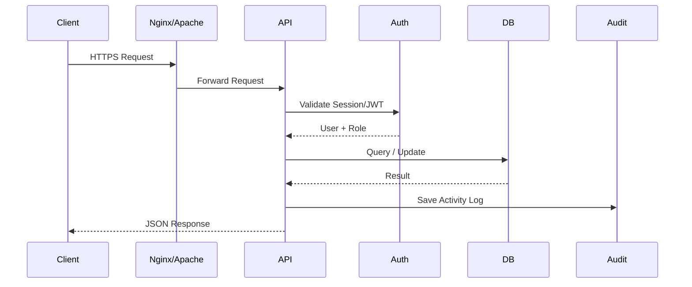

---

## 9. Frontend Architecture

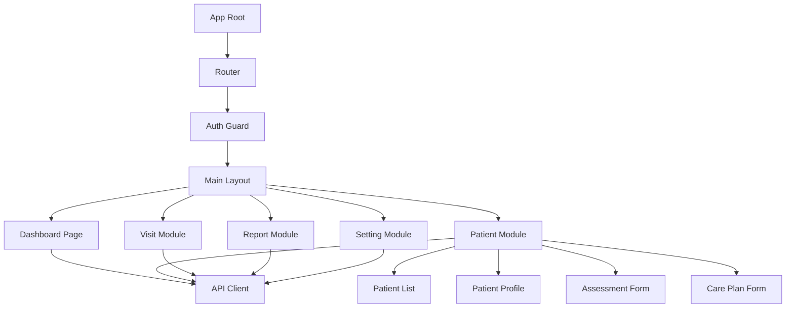

### Suggested Frontend Structure

```text
frontend/
├── src/
│   ├── app/
│   ├── components/
│   ├── pages/
│   │   ├── dashboard/
│   │   ├── patients/
│   │   ├── visits/
│   │   ├── reports/
│   │   └── settings/
│   ├── services/
│   │   ├── apiClient.ts
│   │   ├── authService.ts
│   │   ├── patientService.ts
│   │   └── reportService.ts
│   ├── hooks/
│   ├── stores/
│   └── utils/
```

---

## 10. Backend Architecture

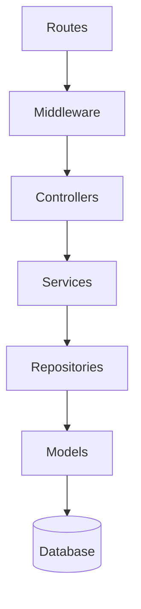

### Suggested Backend Structure

```text
backend/
├── app/
│   ├── controllers/
│   │   ├── AuthController
│   │   ├── PatientController
│   │   ├── AssessmentController
│   │   ├── VisitController
│   │   └── ReportController
│   ├── services/
│   │   ├── AuthService
│   │   ├── PatientService
│   │   ├── AssessmentService
│   │   ├── VisitService
│   │   └── ReportService
│   ├── repositories/
│   ├── models/
│   ├── middleware/
│   └── jobs/
├── database/
├── routes/
└── tests/
```

---

## 11. Security Architecture

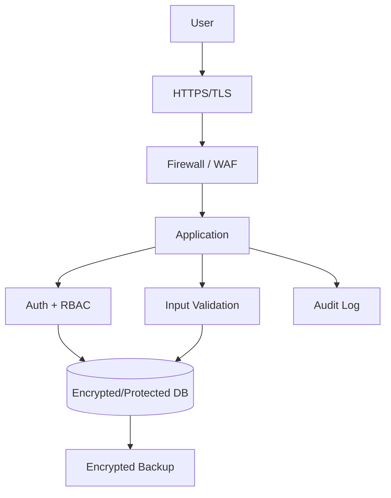

### Security Checklist

- ใช้ HTTPS ทุก request
- Hash password ด้วย bcrypt/argon2
- ใช้ Role-Based Access Control
- แยกสิทธิ์ Admin/Doctor/Nurse/Staff/Viewer
- Validate input ทุก endpoint
- ป้องกัน SQL Injection ด้วย ORM/Prepared Statement
- ป้องกัน XSS ด้วย output escaping
- จำกัดขนาดและชนิดไฟล์ upload
- บันทึก audit log ทุก action สำคัญ
- Backup database แบบเข้ารหัส
- ไม่เก็บ secret ใน source code
- ใช้ `.env` สำหรับ config
- เปิด log เฉพาะที่จำเป็น ไม่ log CID/password/token

---

## 12. Deployment Architecture

### Single Server Deployment

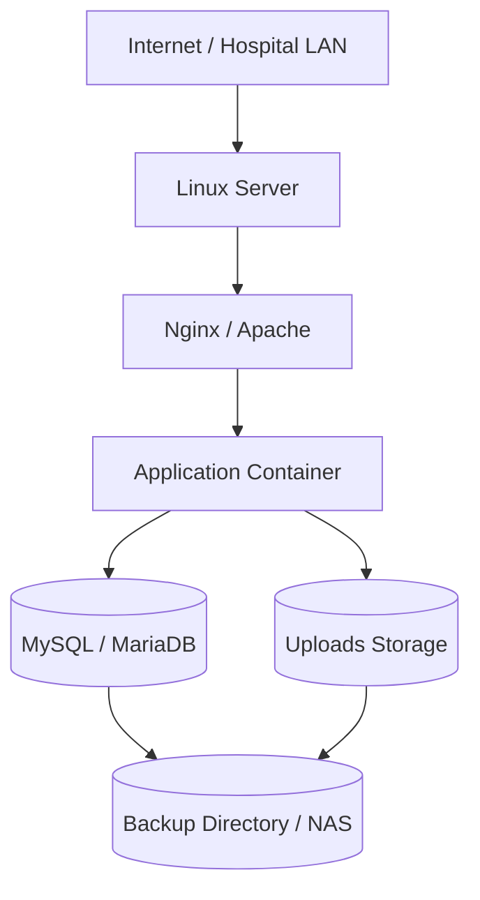

### Docker Compose Deployment

```text
docker-compose.yml
├── reverse-proxy
├── frontend
├── backend-api
├── database
├── redis
├── queue-worker
└── backup-service
```

### Recommended Server Spec

| Environment | CPU | RAM | Storage | Database |
|---|---:|---:|---:|---|
| Development | 2 Core | 4 GB | 50 GB | MySQL/MariaDB |
| Small Hospital | 4 Core | 8 GB | 200 GB SSD | MySQL/MariaDB |
| Province Level | 8 Core | 16 GB | 500 GB SSD + NAS | PostgreSQL/MySQL |

---

## 13. Backup and Restore Architecture

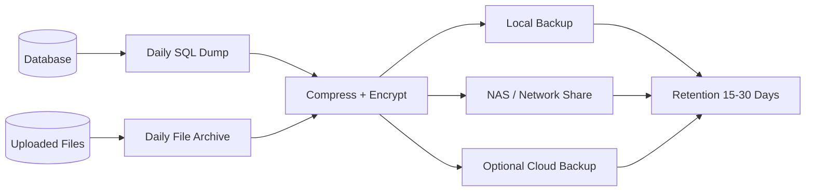

### Backup Policy

```text
Database Backup : ทุกวัน 02:00
File Backup     : ทุกวัน 02:30
Retention       : 15-30 วัน
Monthly Backup  : เก็บ 12 เดือน
Restore Test    : ทดสอบอย่างน้อยเดือนละ 1 ครั้ง
```

---

## 14. Integration Architecture

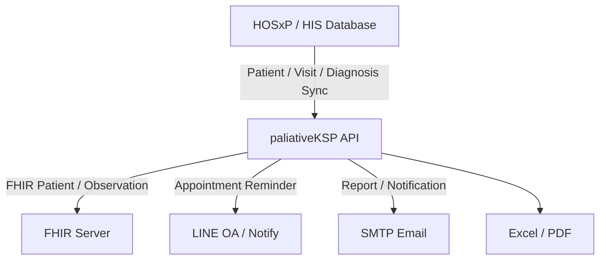

### HOSxP Integration Concept

```text
Sync Data From HOSxP:
- patient.hn
- patient.cid
- patient.fullname
- patient.birthdate
- patient.address
- ovst.vn
- ovst.vstdate
- ipt.an
- icd10 diagnosis
- doctor/nurse note if permitted
```

### Integration Strategy

1. Phase 1: Manual import via Excel/CSV
2. Phase 2: Read-only DB view from HOSxP
3. Phase 3: Scheduled sync job
4. Phase 4: API/FHIR-based integration

---

## 15. Reporting Architecture

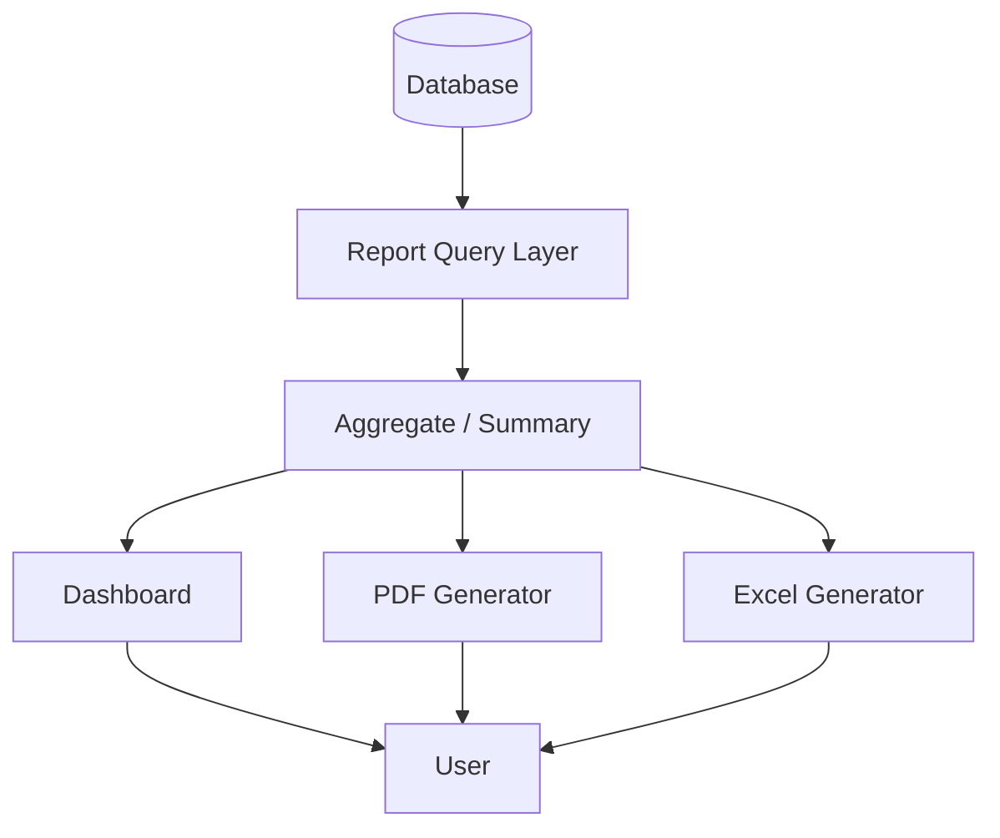

### Recommended Reports

- จำนวนผู้ป่วย Palliative ทั้งหมด
- ผู้ป่วย active / discharge / deceased
- ผู้ป่วยแยกตามตำบล/หมู่บ้าน
- คะแนน PPS ล่าสุด
- Pain Score ล่าสุด
- ผู้ป่วยที่ต้องเยี่ยมบ้านในเดือนนี้
- รายงานการเยี่ยมบ้าน
- รายงานผู้ป่วยอาการแย่ลง
- รายงานส่งต่อ
- รายงานสำหรับผู้บริหาร

---

## 16. CI/CD Architecture

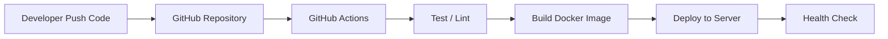

### Suggested GitHub Actions Pipeline

```yaml
name: CI/CD

on:
  push:
    branches: [ main ]

jobs:
  test-build-deploy:
    runs-on: ubuntu-latest
    steps:
      - uses: actions/checkout@v4
      - name: Run tests
        run: echo "Run backend/frontend tests"
      - name: Build
        run: echo "Build application"
      - name: Deploy
        run: echo "Deploy to production server"
```

---

## 17. Observability and Audit

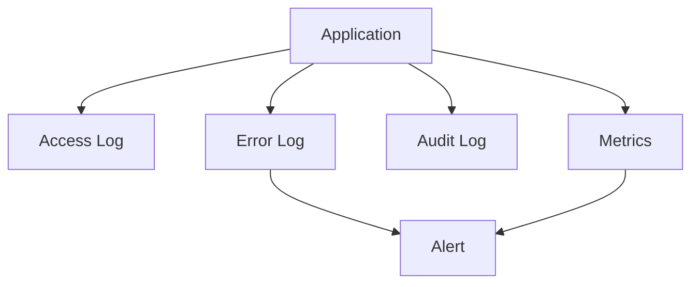

### Logs ที่ควรมี

| Log | Purpose |
|---|---|
| Access Log | ใครเข้าใช้งานเมื่อไหร่ |
| Audit Log | ใครแก้ไขข้อมูลอะไร |
| Error Log | ตรวจสอบ bug/runtime error |
| Integration Log | ตรวจสอบ sync HOSxP/API |
| Backup Log | ตรวจสอบ backup สำเร็จหรือไม่ |

---

## 18. Mobile / PWA Architecture

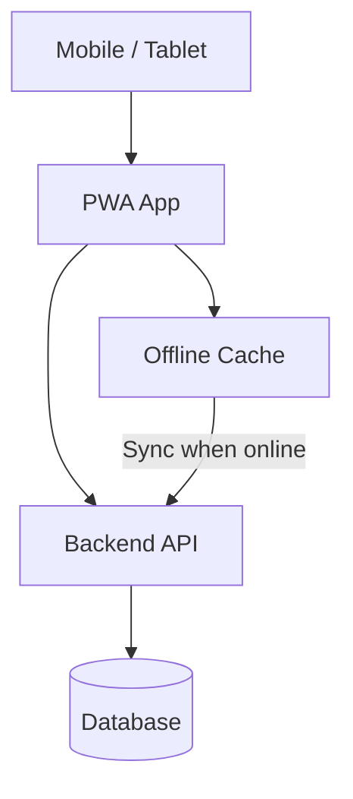

### Mobile Features

- Login
- รายชื่อผู้ป่วยที่ต้องเยี่ยม
- บันทึกเยี่ยมบ้าน
- บันทึก Pain Score / PPS / ESAS
- แนบรูปภาพ/เอกสาร
- Offline draft และ sync ภายหลัง
- แผนที่บ้านผู้ป่วย

---

## 19. Development Roadmap

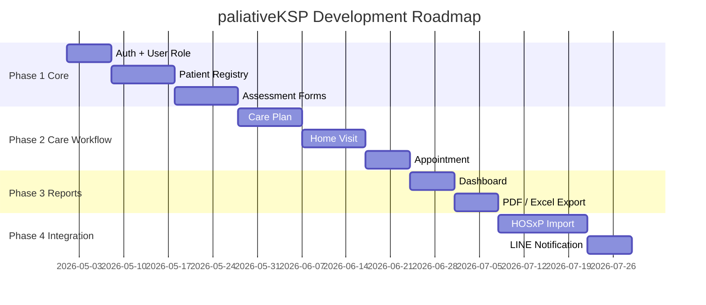

---

## 20. Recommended Repository Structure

```text
paliativeKSP/
├── docs/
│   ├── flowchart.md
│   ├── architecture.md
│   ├── api.md
│   ├── database.md
│   └── deployment.md
├── frontend/
│   ├── src/
│   ├── public/
│   ├── package.json
│   └── Dockerfile
├── backend/
│   ├── app/
│   ├── routes/
│   ├── database/
│   ├── tests/
│   ├── .env.example
│   └── Dockerfile
├── database/
│   ├── migrations/
│   ├── seeders/
│   └── schema.sql
├── scripts/
│   ├── backup.sh
│   ├── restore.sh
│   └── deploy.sh
├── docker-compose.yml
├── README.md
└── .github/
    └── workflows/
        └── ci.yml
```

---

## 21. Production Checklist

### Application

- [ ] Login / Logout
- [ ] Role Permission
- [ ] Patient Registry
- [ ] Assessment Form
- [ ] Care Plan
- [ ] Home Visit
- [ ] Appointment
- [ ] Report Dashboard
- [ ] PDF / Excel Export

### Security

- [ ] HTTPS
- [ ] Password Hashing
- [ ] RBAC
- [ ] Audit Log
- [ ] Input Validation
- [ ] File Upload Validation
- [ ] Backup Encryption

### Infrastructure

- [ ] Docker Compose
- [ ] Nginx/Apache Reverse Proxy
- [ ] Database Backup
- [ ] Log Rotation
- [ ] Monitoring
- [ ] Restore Test

### Integration

- [ ] HOSxP Import
- [ ] LINE Notification
- [ ] FHIR Mapping
- [ ] Export Format

---

## 22. Architecture Decision Records

### ADR-001: API-first Architecture

ใช้ Backend API แยกจาก Frontend เพื่อให้รองรับ Web, Mobile และ Integration ได้ในอนาคต

### ADR-002: Role-Based Access Control

ข้อมูลสุขภาพเป็นข้อมูลอ่อนไหว จึงต้องควบคุมการเข้าถึงตามบทบาทของผู้ใช้

### ADR-003: Audit Log Required

ทุกการดู/เพิ่ม/แก้ไข/ลบข้อมูลสำคัญควรมี audit log เพื่อรองรับการตรวจสอบย้อนหลัง

### ADR-004: Modular Domain Design

แยก module ตาม business domain ได้แก่ Patient, Assessment, Care Plan, Home Visit, Report และ Integration เพื่อให้พัฒนาต่อได้ง่าย

---

## 23. Summary

สถาปัตยกรรมที่แนะนำสำหรับ `paliativeKSP` คือระบบแบบ modular API-first ที่มี Web UI, Backend API, Database, Report Service, File Storage, Audit Log, Backup และ Integration Layer โดยสามารถเริ่มจาก single-server deployment ก่อน แล้วค่อยขยายเป็น Docker/Kubernetes หรือเชื่อมต่อ HOSxP/FHIR ในอนาคต
