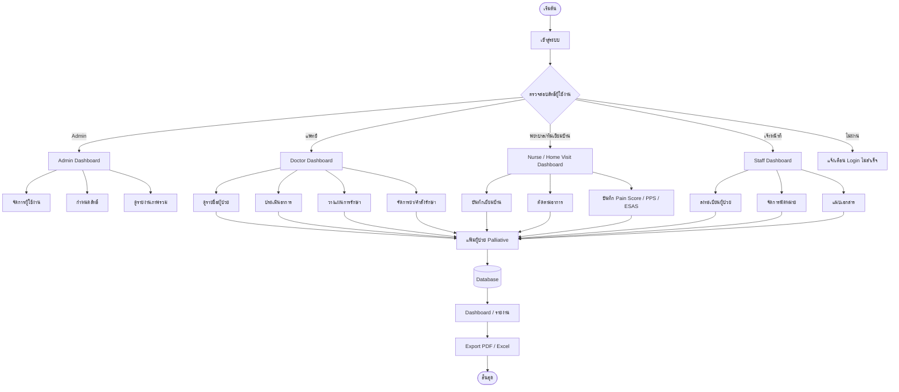
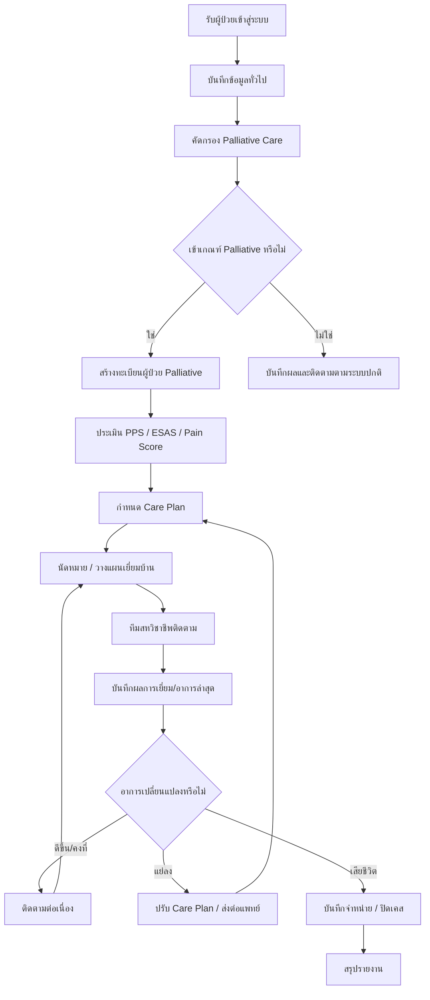
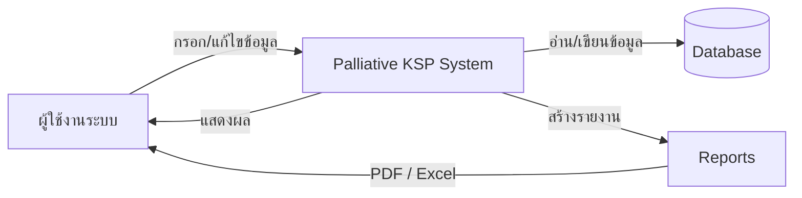
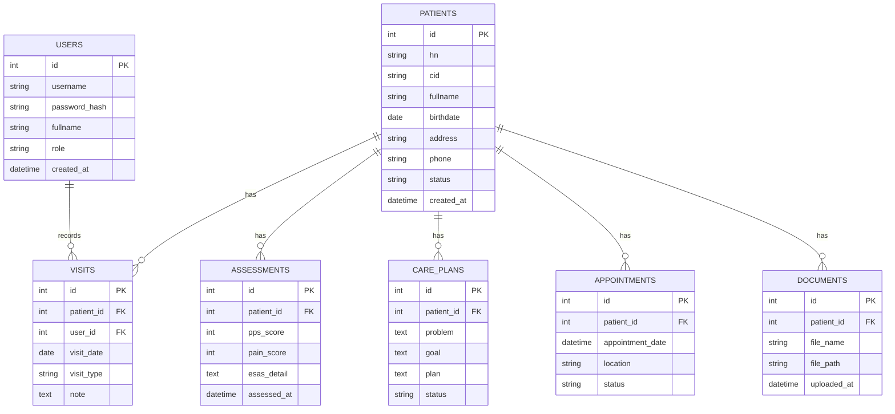
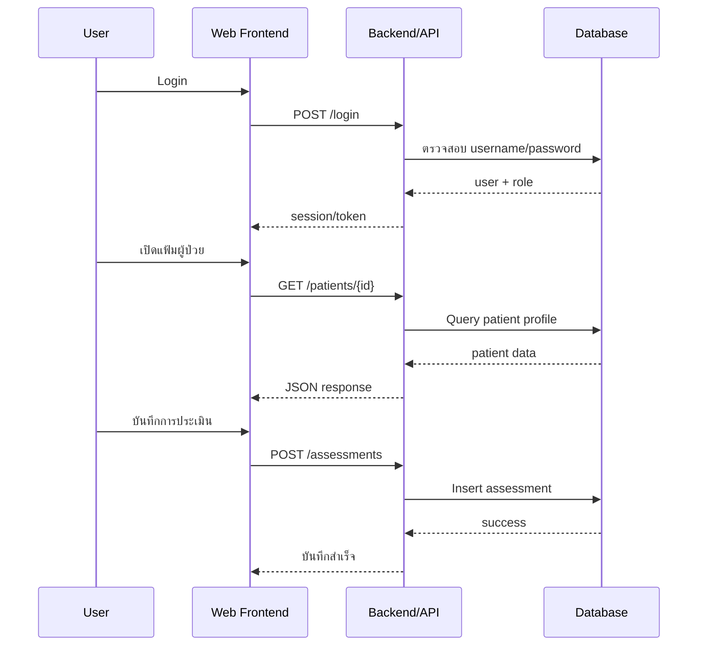

# Flow Chart: paliativeKSP

> เอกสารนี้เป็น flow chart ภาพรวมสำหรับระบบ `paliativeKSP` เพื่อใช้เป็นเอกสารประกอบการพัฒนา/ส่งต่องาน
>
> หมายเหตุ: สร้างจากการออกแบบระบบ Palliative Care Web Application ตามชื่อโปรเจกต์และบริบทการใช้งาน เนื่องจากไม่พบไฟล์โครงสร้างหลักใน root เช่น `README.md`, `package.json`, `composer.json`, `index.php` ผ่านเครื่องมือที่อ่านได้ในขณะสร้างเอกสารนี้

---

## 1. System Overview Flow



---

## 2. Patient Care Workflow



---

## 3. Data Flow Diagram Level 0



---

## 4. Database Relationship Concept



---

## 5. API / Web Request Flow



---

## 6. Recommended Folder Structure

```text
paliativeKSP/
├── docs/
│   └── flowchart.md
├── frontend/
│   ├── pages/
│   ├── components/
│   └── services/
├── backend/
│   ├── controllers/
│   ├── models/
│   ├── routes/
│   ├── middleware/
│   └── services/
├── database/
│   ├── migrations/
│   └── seeders/
└── README.md
```

---

## 7. Suggested Next Diagrams

- Use Case Diagram
- DFD Level 1 / Level 2
- Deployment Diagram
- CI/CD Flow
- Backup & Restore Flow
- HOSxP Integration Flow
- ThaiCareCloud / FHIR Integration Flow
